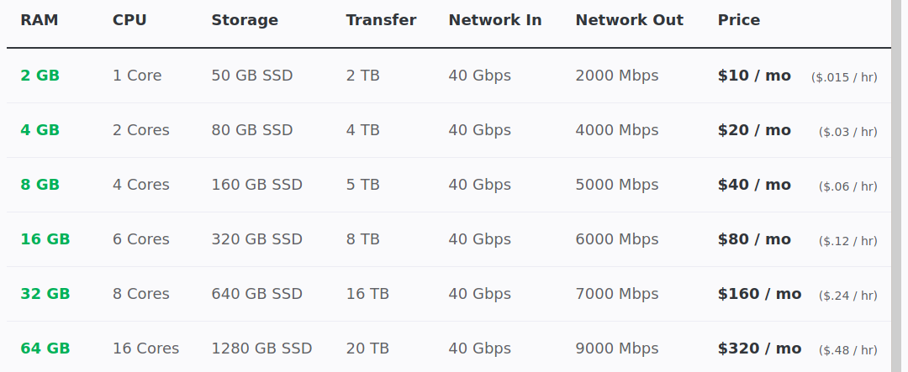

Following [this template from HubSpot](https://blog.hubspot.com/marketing/marketing-plan-template-generator)

1. Conduct a situation analysis.
2. Define your target audience.
3. Write SMART goals.
4. Analyze your tactics.
5. Set your budget.

## Business Summary

*Teaching Code to Those Outside the System*

Rebel Coding provides comprehensive entry-level information on-boarding new coders to the community.

Providing engaging and community-centric projects new coders can build and contribute to, empowering new coders to build confidence in their own skills.

Providing a community where questions are encouraged and space made safe for beginners who may feel they have *silly* questions.

## SWOT Analysis

### Strengths

+ Solid brand name - so long as we continue to walk the talk
+ Sustainable projects for new coders to cut their teeth on
	+ projects serve a public good
	+ projects are ever-growing
	+ projects have multiple components allowing for varied levels of contribution
+ Barrier to entry is purposely low
+ Focused on entry-level coders our audience is constantly growing
+ CC being a self-taught dev, speaks from experience of learning
+ Website & Books have a professional aesthetic

### Weaknesses

+ CC is a self-taught programmer
	+ not formally trained on all of the nuances
	+ Need to comprehensively learn and teach algos & data structures 
+ CC small initial network for outreach
+ EYN2K remain incomplete
+ Bootstrapped w/ zero funding
+ Code Testing is not covered as a topic!!!

### Opportunities

+ To interact personably with all new coders
+ To build a community of support
+ To learn about projects others are building and support them
+ Getting sponsors to advertise with us
	+ only allowing sponsors who align with our values
	+ building relations with non-traditional tech sponsors

### Threats

+ People stealing our access to social media platforms
+ Criticism for not being formally trained & providing incorrect information

## Business Initiatives

**Rebel Coding Books** are designed to be text-book quality resources available in PDF, EPUB & MOBI formats, as well as being available online.

**Rebel Coding Platform** is a browser-based learning platform built on JupyterHubs, which is extensible to on-board new coders to machine learning and data science, as well as the basics of coding.

**Rebel Coding Community** is built around a Discord server, providing space for coding questions and banter.

**Rebel Coding Projects** are built around the ScreamFreely family of applications, new coders are encouraged to build scrapers to contribute to this project, as a way to both hone their coding skills and support their own communities.

## Target Market

### User Personas

We can't serve everyone, but here's a place to start.

+ [Felix](./userpersonas/felix) is a day laborer who wants out.
+ [Xochi](./userpersonas/xochi) wants to works from home while raising children.
+ [Jerich](./userpersonas/jerich) doesn't like his degree, wants into tech.
+ [Serena](./userpersonas/serena) wants to build a second career.
+ [Terrance](./userpersonas/terrance) is a recruiter who wants to get the jobs he's getting others.
+ [Angela](./userpersonas/angela) wants to be location independent.

### Competitor Analysis
Search *how to build* websites, scrapers, etc.

[Google](./searchresults/google) | [DuckDuckGo](./searchresults/duckduckgo)

Visit front-page results and compare.

*What other terms should I search??*

### Inspiration / Other Successes in the Sector

+ [Free Code Camp](https://www.freecodecamp.org/)
+ [Eloquent JavaScript](https://eloquentjavascript.net/)

## Marketing Strategy

> The "seven Ps of marketing." These Ps are product, price, place, promotion, people, process, and physical evidence

## Budget & Beyond

$0

Estimated MEM usage may increase for SciPy work

| Users | RAM | $15 | $12 | $10 | Server Cost |
|------ | --- | --- | --- | --- | ----------- |
|  10   | 1.5GB | $150 | $120 | $10 | n/a |
|  20   | 3GB | $300 | $240 | $200 | $15 / mo |
|  50   | 8GB | $750 | $600 | $500 | $40 / mo |
|  100   | 16GB | $1500 | $1200 | $1000 | $80 / mo |

**DigitalOcean & Linode Pricelist**

## Marketing Channels

First access the CC's Twitter audience, find niche supporters to recast RC to their network.

Gumroad's Discovery brought in our first sale!! Add key words to support this opportunity.

Are there places to publish essays about CC's own coding journey?

Post in Techqueria and on IndieHackers

# More Helpful Links

- [Forbes Article](https://www.forbes.com/sites/alejandrocremades/2018/12/03/how-to-create-a-marketing-plan/)
- [10 Great Questions to Ask Yourself](https://www.thebalancesmb.com/how-to-write-a-small-business-marketing-plan-2951749)
- [20 Templates - Dig for Gems](https://venngage.com/blog/marketing-plan/)
= [SWOT Analysis](https://blog.hubspot.com/marketing/swot-analysis)