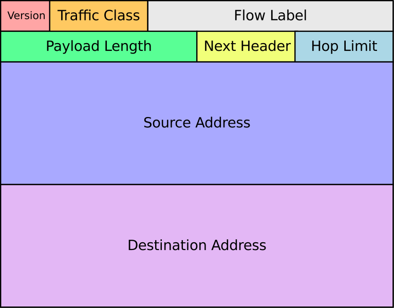

<!-- ## Step 4: The Full-Stack -->

Let’s take a moment to reflect on what the "full-stack" actually is. 

How does it all connect? 

**If the full-stack were a restaurant:**

The **database** is our walk-in’ cooler, and deep freeze; holding all the data that changes, or the food that will be used to prepare meals for our guests/visitors.

The **server** is the kitchen; using the contents of the cooler/freezer to fulfill our data requests, or orders, as made by the client …

And the **client** is more like the waitstaff; taking the orders, and fulfilling requests.

If you still have confusion, don’t hesitate to ask in the Discord server!

Though now let’s review each component further in-depth.

## The Database

The *classic* database is the SQL database; a relational-database.

What does relational database even mean?

Tables, with columns and rows; spreadsheets of data; which are enabled to connect between multiple tables/sheets through *joins*.

Say you’ve got a list of users, and  a list of their posts, their likes, their pictures, their videos and their user history!

That would be a giant table!!!

I mean, because each of those items has their own properties; what’s worse, some of the items aren’t really related, or some of them might be related to items from other users !?!

It is much easier if we can have a separate table for each one of these item-sets; and for our users, have a unique and static ID by which we can connect them to other tables.

Welcome to the wondrous magic of SQL laid out before you, a child of royalty looking out across a vast and unknown wilderness that will one-day be yours.

Though there are more than just relational databases.

Now we also have NoSQL databases, which come in four primary flavors: document, graph, key-value, and wide-column.

We won’t get into all of these nuances right now; though we will introduce you to many of these topics in adjacent materials.

### DB Operations

The reasons for databases are not just to contain information but to perform CRUD.

**Create**, **Retrieve**, **Update**, & **Delete**.

Databases have these four primary functions to maintain data and allow for its *creation*, *retrieval*, *update* and *deletion*.

This is often shortened to be called CRUD procedures.

Within the past two decades, the commercially available database technology has grown to include products called no-SQL products.

SQL stands for “Structured Query Language” and is the language used to create and maintain relational database management systems (RDBMS).

These are our dynamically linked rows and columns.

NoSQL arose for two reasons, to diversify the storage format for databases, and reduce the number of database calls necessary to retrieve dynamic information.

It would be easy for us to get lost describing these differences and nuances, so I leave further investigation to your own interest; save the information provided below to help you get started.

### Relational Database

Onwards to Relational Databases! The primary relational-databases you will run into are MySQL/MariaDB, PostgreSQL, and MSSQL; MariaDB being the open-source version of the Oracle product MySQL. While MSSQL is Microsoft’s own proprietary version of SQL.

Thankfully the foundations of SQL syntax are consistent across all SQL versions; in fact, it is the SQL language which unifies them.

`SELECT id,name,email FROM user_table;`

As alluded to earlier, each variation has their own nuances; Microsoft has it’s propriety features, as does MySQL; some of which MariaDB seeks to mimick or improve. 

In this course, we will focus on PostgreSQL, or Postgres.

It remains at the top of it’s class, pushing the envelope of feature development; while maintaining a robust community and stable codebase.

#### PSQL

As shown in our previous model; both the column and the table name are identified.

The theory is that you are in the correct database to begin with; though if you are not … ‘db name’, replacing ‘name’ with the name of your desired database.

##### SELECT

We’ve already seen this in action; this is a basic

##### Conditional SELECT WHILE

Using filters to find specific data

`SELECT id,name,email FROM user_table WHILE email=”*edu”;`

This command will return all of the requested data, but only for email addresses that end with “edu”.

This command is made more dynamic with the addition other commands such as AND, OR , DISTINCT, ORDER BY and more.

##### JOINs

We spoke about being able to connect tables; and we do this through JOINs.

SELECT Users.id, Posts.id, Posts.title, Posts.content

FROM Posts JOIN Users ON Users.id, Posts.user; 

Can you see the logic? We need to identify the column that we are going to use for matching; and then ‘join on’ that match.

### NoSQL

MongoDB, others … 

key-value store

document store

column-oriented database

graph database

## The Server

CMS Content Management System ~ A place to put digital stuff.

There are different computer languages, and thus different platforms built using these varied languages.

What does the server do?

Often times, the server serves an API (Application Programming Interface)

The basis of a CMS is the ability to create, maintain and modify digital assets; though this says very little about how they are displayed.

And it is on this point that many CMS’s vary.

For example, whereas WordPress provides a variety of themes Django provides next to nothing for initial user-facing displays; Node/ExpressJS, even less.

Though technically Node is more of a framework, as is Express; with which Client’s interact.

For the sake of education, let’s review some of the most popular CMS’s.

### PHP 

#### Wordpress

WordPress is built using the PHP language, and is one of the most popular Content Management Systems on the web.

There is a massive variety of free, and paid, themes available; and even more plugins one can use to extend its functionality.

With regard to our server / API-layer, there are two primary categories utilized by Wordpress, posts and pages.

So in our database there are essentially four tables, or content types, beyond the User table:

Posts, Pages, Tags and Categories.

Mind you this is a highly simplified instance of a Wordpress site.

All the basics need to begin building a basic website for blogging; which is what makes WordPress so popular: its simplicity.

#### Drupal

Getting a bit more complicated, yet still built in PHP, we have Drupal.

Considered an Enterprise-level CMS, Drupal provides a level of customization that Wordpress does not.

Remember how Wordpress provided only two initial content-types: Post and Page?

Drupal expands upon these options enabling users to easily manage a blog, forum, and polls, if they choose.

These modules use generic "nodes" as a basis for pieces of content which are divided into "Content types".

In turn, these new content-types can have fields such as images, videos, polls, or other custom data types attached to each one. 

In this fashion a website with many different types of content can be created, making Drupal a common choice for media companies and governments that require complex displays

It should be noted that while Wordpress refers to its add-ons as *plug-ins*, Drupal refers to these components as *modules*.

If you, the developer, choose to enable the blog, forum, book and poll modules in Drupal, these additional, pre-baked, content-types are made immediately available to you.

As well, Drupal is lauded for its robust security!

Though the price paid it, is its barrier to entry, Drupal is a beast; and requires an advanced awareness to develop and maintain.

### Python

Let’s start with why not Django - it’s a rather large framework from the outset.

You need to have a functional concept of the entire platform in order to work on it.

You need to know Python to work on it.

So why are we using Django?

Because it’s a large framework that will give us a concise overview of all of the working parts of a server.

And it gives us a chance to learn Python, one of the most versatile and in-demand coding languages in the world.

A better question could be why Python?

#### Django

Now we are transitioning to more formal server-based frameworks, that are less, content management systems, and more web-application frameworks.

Both Wordpress and Drupal come with predefined content-types.

Django, and Ruby on Rails, allow you to define your content types!

Django is built using the Python language, and is often appreciated for the built-in Administrative interface it provides.

This is how it blurs the line between a web-application interface and a more formal CMS.

Django also provides a templating mechanism, by which user interfaces can be built.

Able to interact with multiple database types, Django allows you fine-grain tuning for each and every database table, row and interaction.

If you need 15 different content-types, Django provides the tools to specify each aspect of them all.

Another, lighter framework, built using Python is called Flask.

#### Flask

### Ruby on Rails

Ruby on Rails, or Rails, is built using the Ruby language, and provides many of the same features as Django, f*or the sake of our introductory conversation*. 

Wikipedia provides a most accurate description:

**Ruby on Rails**, or **Rails**, is a server-side web application framework written in Ruby under the MIT License. Rails is a model–view–controller (MVC) framework, providing default structures for a database, a web service, and web pages.

Again, Rails focuses less on the aesthetics of the user interface, only providing the bare necessities required.

This being where the Client, of which we speak about soon, comes into play.

Though let’s take a moment to talk about this MVC framework that has been mentioned.

### NodeJS

NodeJS has gained popularity; due to JavaScripts ubiquity amidst client frameworks.

NodeJS give JavaScript developers access to server side operations previously inaccessible to the JavaScript language.

### Go

Is a new language, combining elements of lower level process with higher-level behavior.

## Model-View-Controller

MVC is a design pattern meant to simplify “program logic into three interconnected elements.” Thank you Wikipedia!

### Model

Remember all of those content-types we had mentioned earlier? The tables in our database?

We were given two in Wordpress, an additional four in Drupal, and using Django or Rails, we could make as many as we need!

These are considered our Models, or object-models, if you will.

Each table in our database houses a different object, which is loosely defined by the parameters determined by its model.

### View

Next, our models do us little good if they are just sitting in the database, and so we need a mechanism to define how they can be viewed.

And our Views provide this template.

The semantic magic is astounding I know.

### Controller

Though now does one get the information from the database to the View?

We know that servers operate in this role for our full-stack ecosystem, though what part of the server actually controls this process.

Eureka, our controllers!

When a View asks for blog posts, sometimes you only want the 10 most recent posts.

Or you only want posts with a certain tag.

Here is where Controllers are used to fulfill a Views request, and augment what is retrieved from the database per the Views specifications.

It should be noted that while the terminology used here was rather straightforward, Django, the framework with which we work with in Everything You Need to Know, subverts some of these words.

Some call Django a Model-View-Template framework, as the Views in Django act more like controllers, while templates provide the function we previously allocated to Views.

Mind you, I said that Views act *more like*, not *exactly like*, controllers.

Developers can be an opinionated group of folks, and this can be one-point of heated debate.

Though this is also too much minuta for our introductory purposes here, so let’s move on to the Client!

## The Client

The Client component of the full-stack ecosystem consumes an API, to populate an interactive user interface.

And this space is dominated by JavaScript!

JavaScript allows us to create SPA’s ~ single-page applications; but interacting without servers, while never needing to reload our web-page.

Remember how we used jQuery earlier to *show sibling divs*, while hiding all of the others?

That is just the beginning of what JavaScript enables us to do!

Using the technology of AJAX, asynchronous JavaScript and XML, we can make calls to our server, retrieve our data, and display it, all without having to reload our web page.

We can make adjustments to these calls, and even respond to user input to customize these calls.

Again, all without ever having to reload our web-page.

This is how websites like Netflix seem to operate so fluidly.

#### React vs Angular

There are two main competitors ReactJS vs AngularJS.

Besides one being the creation of Facebook, and the other a creation of Google; they have other distinct differences.

AngularJS is similar to Django, in that it provides everything needed right out of the gate! Routers, BAM! Modules, BAM! Components, BAM!

Everything and the kitchen sink, as they say --- 

Conversely React is more minimal, providing the core of what is needed, and enabling you to add only what is necessary.

In Everything You Need to Know, we introduce you to a third framework, called Vue.

JavaScript is a vast and ever-expanding collection of technologies; and we’re only going to acquaint ourselves with the basics ~ all of which we’ve already covered.

Each framework has its own nuances to accomplish the basic task of retrieving information, either from our server, or from the user, and then adjusting what is displayed accordingly.

And there are numerous books, websites, videos and platforms dedicated to explaining, and debating, the nuances of each.

Now, hopefully, you have a solid foundation upon which to better comprehend what these folks are talking about!

#### Why Vue?

## So in conclusion ...

We know that while websites are most often built using HTML, CSS and JavaScript, there is a ton more that is happening behind this layer to bring us the data and information with which we interact.

Databases are used to store information, and servers are used to define and modify the information.

It is this last layer of interaction that is governed by HTML, CSS and JavaScript.

Though that brings us to an interesting question … how exactly does the information get from the database/server/client stack to our browser?

Welp, I’m glad you asked!

We’ll end this book with a bit of a history lesson!

### The Brief History of the Internet

Thank you to the [Internet Society](https://www.internetsociety.org/internet/history-internet/brief-history-internet/) for providing the more in-depth summation from which much of this information is gleaned.

Telephones and radios were cool, but they relied on circuits.

What if you could send *packets* of  information ?

Attempting to answer this question ARPANET, or Advanced Research Project Agency Network, was born; and in 1969 the first host computer was connected at the University of California Los Angeles.

A second *node* was installed at the Stanford Research Institute, and soon other nodes we added as well.

In 1972 the technology now known as email, or electronic mail, was introduced and the internet as we know it today was well on it’s way out of infancy!

ARPANET was a closed system, mostly used by university researchers and their corporate counterparts.

It was a network small enough to be nearly “error-proof”; as in packets were rarely, if ever, dropped. Each node architected to specific, if not exact same, specifications as each other.

Thus Bob Kahn was inspired to create a protocol that would be more robust in an open-architecture environment, and so devised what would become known as the Transmission Control Protocol / Internet Protocol (TCP/IP).

What’s your IP number? 

Have you ever searched the question?

It’s like your computer’s address on the internet.

Except this address can change depending on where from you are connecting.

This is simplified picture of what an internet packet looks like.

We have a source address, and a destination address; your computer’s IP address being the destination address.

Servers are located on computers, attached to the internet, and have an IP address as well.

In-between sit a series of other computers that translate these numerical addresses into namespaces and URLs, uniform resource locators.

And so, when you visit a website, your computer sends out a request packet, that travels by a series of numerical addresses to a specified destination.

Once the destination address is found, hopefully the request is fulfilled; and the response returned to your computer.

Thus, you were able to download this book!

Thank you for your time and attention.

I hope this information has been helpful.

Remember, if you have any questions feel free to visit our Discord server, or contact me on the web.

You can find me as Culture Clap on most social platforms, or send me a piece of electronic mail at [canin@dreamfreely.org](mailto:canin@dreamfreely.org).

Happy packeteering fellow coder!

May your data be well based, and your clients always well-served.
