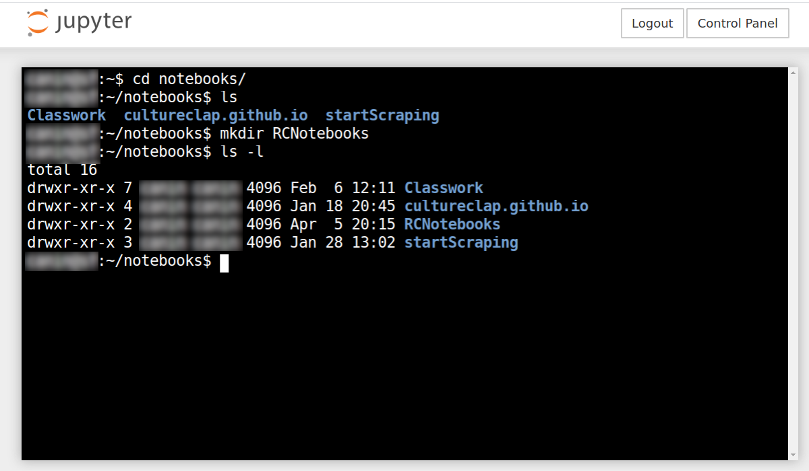
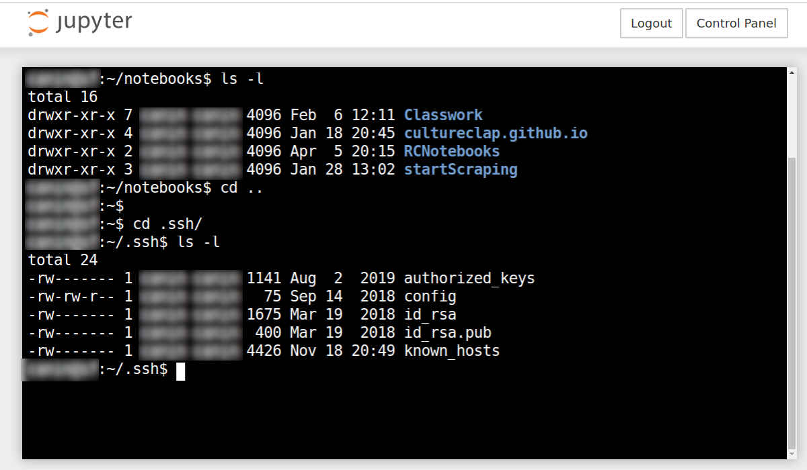
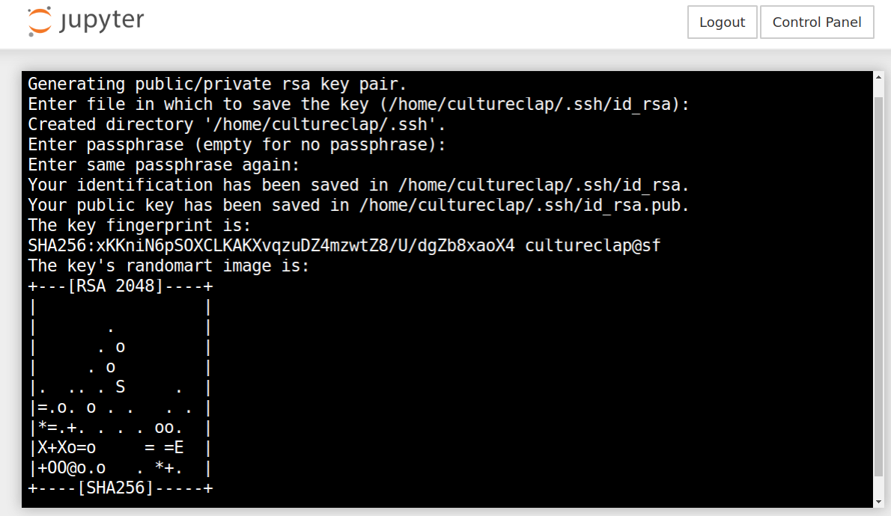
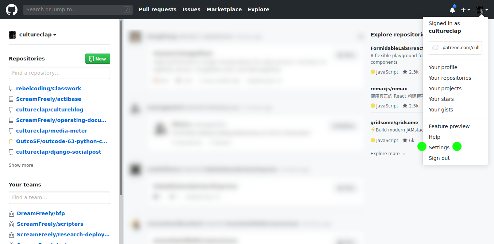
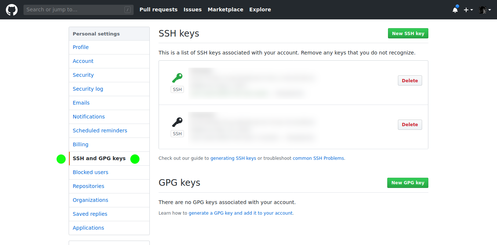
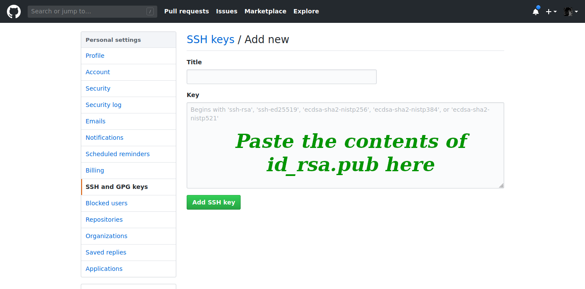
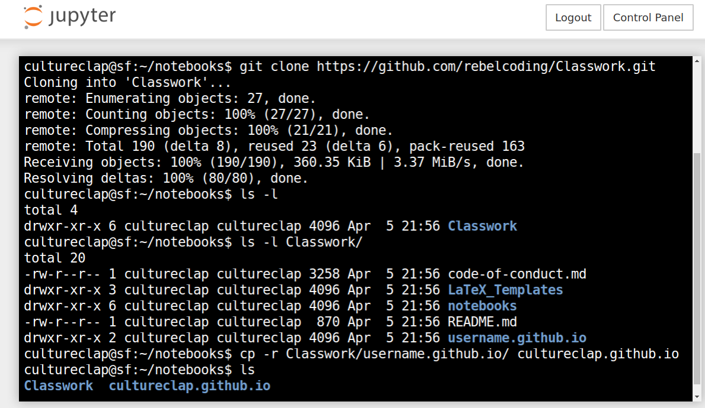

## Intro to Terminal

If you are using a Mac, use Spotlight to search for the Terminal program. Open it up and begin following along; all of these instructions will work the same for you. If you are using Windows, I’m sorry, but we won’t delve into the differences Powershell employs. Rather I recommend you purchase a one month subscription to Rebel Labs, where you can use the Linux terminal provided.

`whoami` & `pwd` are two of the first commands one ought learn. Type each command into the terminal and press Enter.

    $ whoami
    Username
    $pwd
    /home/Username

The first command provides an obvious answer, and the second is obvious enough once you know that it stands for “print work directory”.

Though for a long time, I thought it meant “present working directory”, because that just seems so much more descriptive to me.

Nonetheless, we answer the question, “Where am I?”

In all likelihood, you should be in your “home/{username}” directory.

And if you’re in Rebel Labs (RL), that’s where you will start!

Next, let’s take a look around ~ by typing the command `ls` and pressing Enter.

The `ls` command lists the items in our *present working directory*.

Cool, if we are in the RL we should see a notebooks folder. But let’s back up one moment ~

I want to tell you about **command flags**. 

We just used three commands, `whoami`, `pwd`, and `ls`. The last of which has some other capabilities that can be accessed using command properties, indicated by *flags*.

Instead of just typing `ls` into the terminal, type `ls -l` and press Enter!

Huzzah ~ more details. 

What do they all mean?!? We’re not going to cover that now, peep the appendix.

We’re gonna keep movin’ along. The important thing to note is that this is how command flags work, they need at least one-dash, sometimes two, to precede them. 

Next command: `cd`

If you just typed that in and pressed Enter, nothing will happen.

We need to add a destination, as `cd` stands for *change directory* … type `cd notebooks` and press Enter.

Let’s use `ls` or `ls -l` again, to take a look at what we got …

If you’re in the RL, then you ought to see nothing. And if you’re following along on your own computer … from your home directory lets first use the `mkdir` to make a new directory called RCNotebooks, or whatever name you like.

`mkdir RCNotebooks` and press Enter.

Just like `cd` we needed to provide a name for the directory to be made.

Then we can `cd` into RCNotebooks as shown above, and onward we continue.

## SSH & Hidden Folders

I made a funny, we need to reverse … which is a great chance to learn how we do this in the command line??

Though first off, let’s make a mental model.

I like to consider the file system like chutes and ladders; up and down.

We often start right in the middle. in our home directory /home/user. And everything we initially access is *down* the file system from this location: /home/user/notebooks. /home/user/Desktop, /home/user/Downloads, etc.

Reversing directions would mean to travel back *up* the file stack. We use double-dots to do this, as follows:

`cd ..` and press Enter.

Don’t forget *both dots*!

And we should now be back in our home directory, if we use the command `ls` we should see our Notebooks directory; or use the `pwd` command to confirm your location.

Now we make an SSH key, but what does that even mean?

**SSH - Secure Shell**

Right now we’re using the terminal, or command line interface, and your account is considered a *shell* account; while you have *shell* access. Shell being another word for the *terminal*.

Presumably your account is protected by a password; and it’s a really good one, or it isn’t; that’s not immediately the point.

The point is that every single time you want to get or send project files to a repository; you don’t want to have to retype a password. Plus now you will actually have a super super-secure password! 

## How to make an SSH key

Last things first, we will be making an ssh key *pair*; one file will remain on your computer, and another file will have a ‘.pub’ extension, to be shared.

The security comes through the “handshake” these two files make when connecting between two systems.

We’ve got our terminal open, and we’re in our home directory. Make sure to double check that!

First command: `ssh-keygen`

We will be asked where we want to save the file … look at the file address, what seems weird?

Take note, press Enter and continue.

Next we are asked if we want to attach a passphrase to our SSH key; I humbly suggest it is not necessary at this juncture of your development; and is precisely what we’re trying to avoid, having to type in password.

Leave it blank and press Enter. Then press Enter again to confirm.

Now you will be presented with ‘randomart’. Sometimes this same picture will appear everytime you connect; and the idea is that if this picture ever changes, you will know that something is funky with the connection.

So where are our keys !?

Type in the command `ls -la` and press Enter.

See what I did there? I combined command flags!!!

What’s that folder with the dot in front of it? 

That’s a *hidden* folder, were we viewing this location with a GUI (Graphical User Interface) we might be able to *see* the .ssh folder.

Yup, the single dot is what denotes a hidden folder … let’s cd into the hidden .ssh folder, `cd .ssh`; followed by `ls -l`. What do we see?

There ought to be at least two files, one called id_rsa, and another called id_rsa.pub. And it is this file that we will share with others who wish to grant us access to their systems.

You can type `cat id_rsa.pub` to view the files contents.

## Have you made a GitHub account yet?

In order to most seamlessly complete the next step, we need to make sure you have a GitHub account *with* an SSH key set-up.

I’m going to presume you have figure out how to make an GitHub account, though the following screenshots show you how to register your newly created SSH key!

Once you’re in your GitHub account, click on your profile picture in the upper right-hand corner, and menu will drop down.

Choose the Settings option.

Now that we’re in the Settings menu, we have a set of Settings Categories available to us on the left side of the screen.

Choose the SSH and GPG keys Category.

Remember how we used the `cat id_rsa.pub` to view the contents of our public key earlier?

We did that so we can copy the contents, by highlighting the output, and using a right mouse click to open up an options menu, then choosing copy.

And we will paste that content right into the field, as shown below.

Make sure to give your key a memorable, and descriptive name as well.

Now we’re ready to continue!

## Cloning the Basics

Alright, now that we’ve got all of that taken care of; let’s get our starting materials.

Open up a browser and navigate to [https://www.github.com/rebelcoding/Classwork](https://www.github.com/rebelcoding/Classwork/).

There is a green button near the upper-right corner of the display which reads “Clone or download’. Click this button; if you are signed in and have shared your SSH key with Github choose ‘Use SSH’, otherwise use HTTPS.

Copy the code that is provided for you, and return to the terminal; here we will change directories, back into our notebooks directory: 

`cd notebooks`.

Now we will use a *git* command:

`git clone git@github.com:rebelcoding/Classwork.git`

Last command, make sure to use your GitHub username:

`cp -r Classwork/username.github.io {username}.github.io`

Can you tell what you just did?

## Additional Support

The remainder of this book builds off of the material in this repository. If you are having ANY trouble, please reach out to @RebelCoding or @CultureClap on Twitter; or better yet, check out the community on Discord ~

The last command we ran copied template files for your HTML website. If you’re using GitHub.com you can publish your website to a github.io address that uses your  username.

Refer to Appendix *** to learn how to create this new repository and push your code to it.